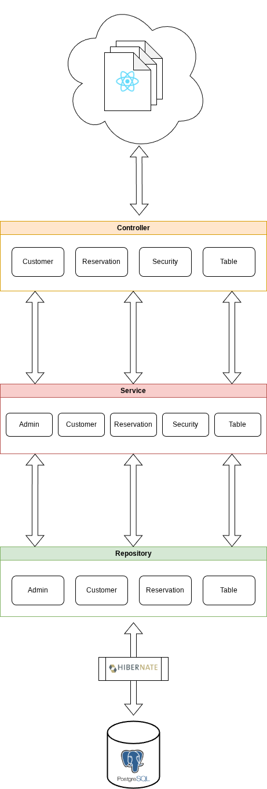
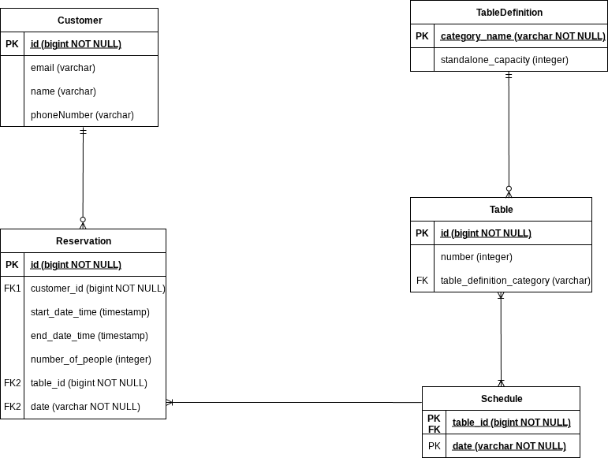

# TableReservation
> A free tool to manage the reservations of your restaurant


TableReservation is an open source web application that lets you define and create your custom tables, each one with a specific maximum capacity, so that it's easy to take all the customers' reservations.
<br>
The web UI helps you easily visualize and manage your table layout, from which it's possible to read, update or delete those reservations for each table

## Installation

1) Install [Docker](https://www.docker.com/) on your machine.
2) Clone the main branch with
```
git clone https://github.com/barberamatteo/tablereservation_app
```
3) Build with Docker Compose via
```
docker compose up --build -d
```


After that, the backend web server will run at localhost:8080, the frontend nginx web server will run at localhost:80 and the PostgreSQL DB will run at localhost:5342.

You can stop the containers with
```
docker compose stop
```
and restart them with
```
docker compose start
```

## Setup

Once the installation process is terminated, it is necessary to create an admin account.
To do it:
1) Run
```
docker attach tablereservation_app-backend-1
```
to attach your terminal's standard input to the container running the Spring Boot Application.

2) Press ENTER to enter CLI mode.
3) Create a pair of credentials using:
```
> createadmin <username> <password>
```
4) Quit CLI mode using:
```
> q
```

5) Detach the backend container by pressing Ctrl + P + Q

Eventually, you can navigate to http://localhost to access to the app GUI with the credentials you just created.
## Architecture

This project follows the MVC pattern:

- **View:** Built with React + Vite (TypeScript). Provides a simple, minimal and responsive UI to manipulate reservation, add customer details, create tables, delete reservations quickly;
- **Controller:** Implemented using *Spring Boot* & *Spring MVC*. This layer handles the HTTP requests from the frontend, coordinates the application flow and features authentication.
- **Model**: Powered by Spring's dependency injection mechanisms, Hibernate (JPA) for ORM, and PostgreSQL for storing business data.

The backend codebase is structured into clear layers: Service, Repository and (obviously) Controller.



## DB Schema

Here follows an ER diagram of the data schema:



The ORM generates automatically some join tables, which are not included in this diagram.

## Documentation

The API documentation page, generated with Swagger OpenAPI, can be retrieved by accessing http://localhost:8080/swagger-ui/index.html after getting authenticated.
Most of non-trivial and non-boilerplate code (e.g. methods) is documented as well.
To generate the Javadoc, just execute the Maven goal (inside the ```be``` directory):
 ```
 mvn javadoc:javadoc
 ```
The static resources can be found in the ```target/reports/``` directory.
